# **ANSIBLE PROJECT 2**

## __Using Ansible To Deploy__
<li> Using Ansible Playbook in the host instance created (this was created using the VPC which was used to create the private instances) Nginx, PHP and PHP configurations where deployed in the private instances (with the help of the NAT Gateway the priavte instances where able to access  the internet).

 

*See the screenshot below*
 
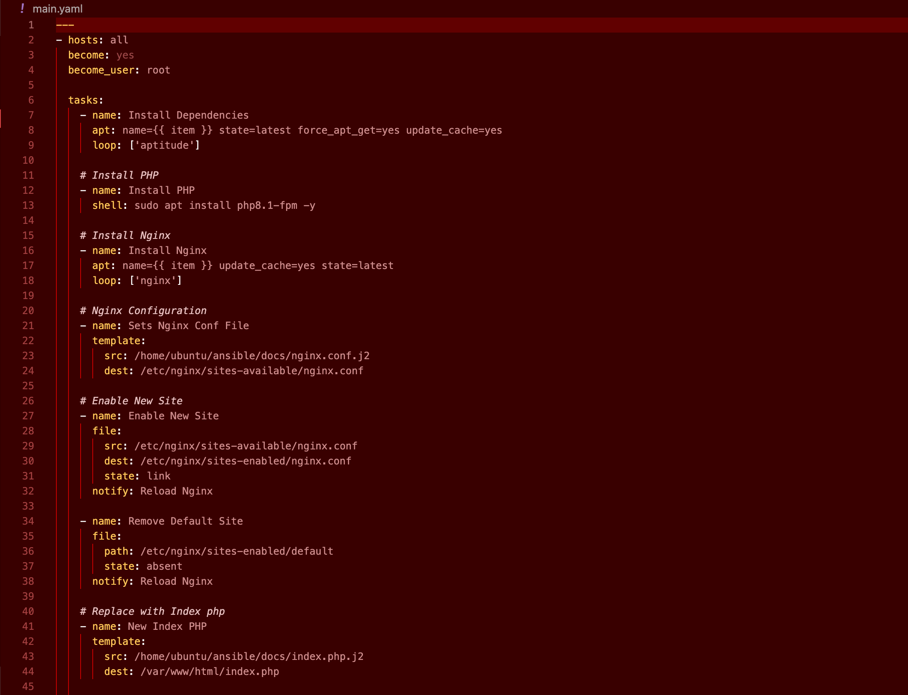
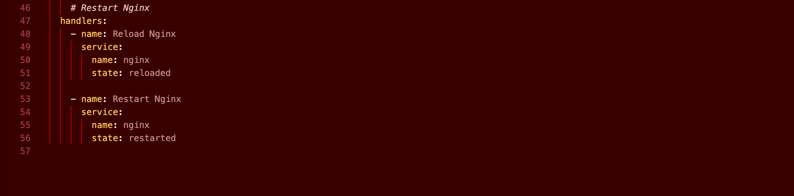
 
 

## __AWS__

### __*Created VPC*__
<li> VPC created with the avialable subnets, and route tables for both  private and public use for EC2 instances.

 

*See the screenshot below*
 
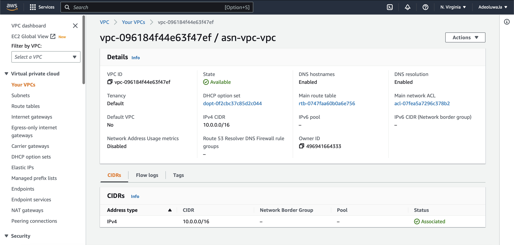
 
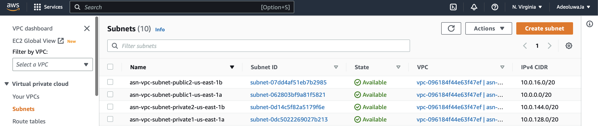
 
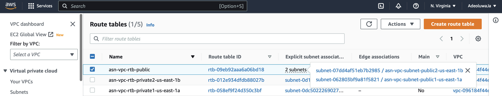
 
 

### __*NAT Gateway*__
<li> This was created so that the private instances can reach the internet and deploy updates or installing nginx and php.

 

*See the screenshot below*
 
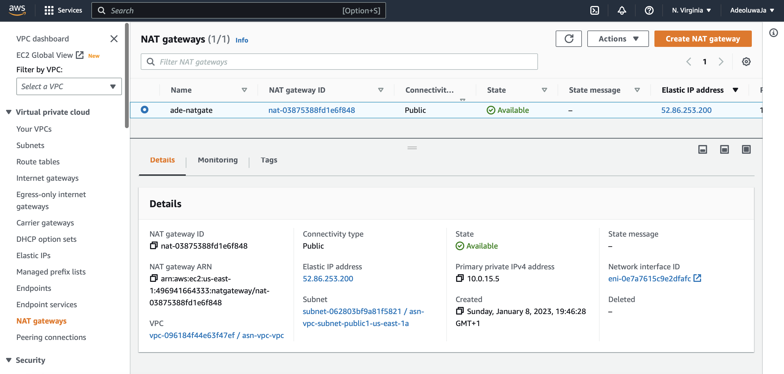

*But was deleted due to the AWS charge assoicated to it*
 
 

### __*EC2 Instances*__
<li> NginxServer1 and NginxServer 2 are the private instances created under the VPC created and the host is the public instance created under the VPC so that the private instances can be viewed, use the NAT Gateway and also how the ansible playbook was ran. 

 

*See the screenshot below*
 
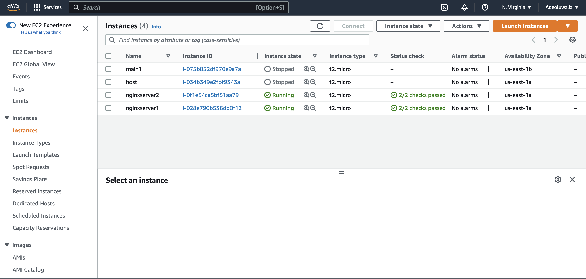
 
 

### __*Target Group*__
<li> Shows the target group and health status of the registered private instances

 

*See the screenshot below*
 
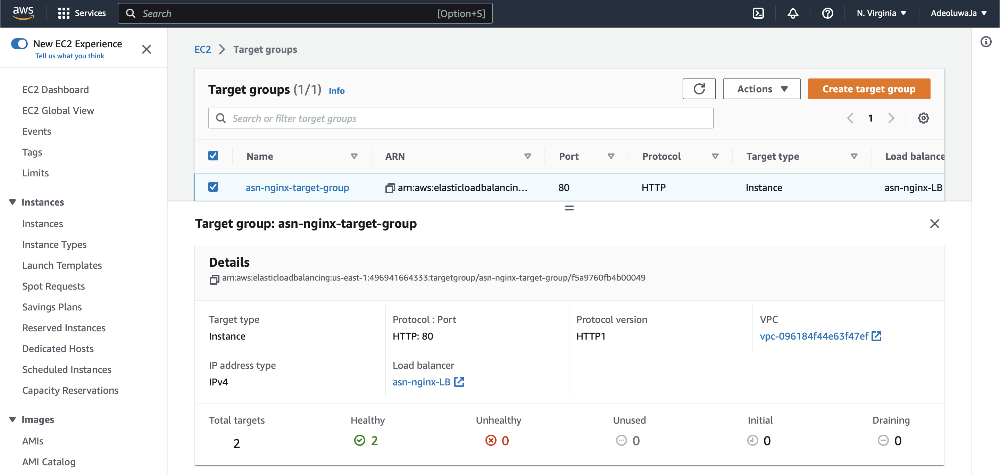

 
 

### __*Load Balancer*__
<li> Displays the content of the private instances registered to the target groups and displays either of the content at a time.

 

*See the screenshot below*
 
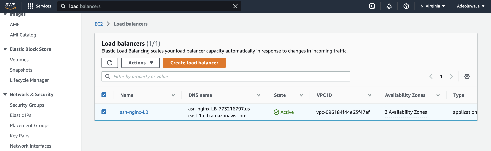

 
 

### __*Content Load Balancer Display*__
<li> Shares the load between them and the displays either at a time.

 

*See the screenshot below*
 
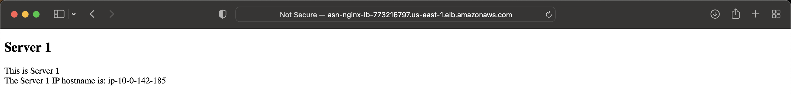
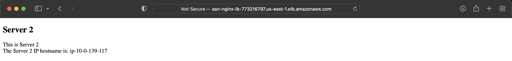
 
